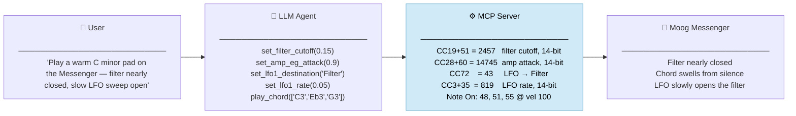

# Moog MIDI MCP Server

A Model Context Protocol (MCP) server that exposes the full control surfaces of five Moog synthesizers as semantically named tools, so an LLM agent (Claude, etc.) can play notes, twiddle knobs, flip switches, and improvise synthesizer textures on your Mac.

**Supported synths:**

| `MOOG_MCP_SYNTH` | Instrument | Type | Tools |
|---|---|---|---|
| `model-d` | Minimoog Model D *(app)* | Virtual port | 81 |
| `model-15` | Moog Model 15 *(app)* | Virtual port | 53 |
| `grandmother` | Moog Grandmother *(hardware)* | USB/DIN MIDI | 32 |
| `matriarch` | Moog Matriarch *(hardware)* | USB/DIN MIDI | 48 |
| `messenger` | Moog Messenger *(hardware)* | USB-C MIDI | 66 |

Built in TypeScript on top of:

- `@modelcontextprotocol/sdk` — MCP server transport (stdio)
- `easymidi` — virtual and hardware MIDI port access (CoreMIDI on macOS)


## Overview

- **One tool per panel control.** Every MIDI-controllable knob, switch, and wheel on each synth is its own tool with a meaningful name and typed value. `set_filter_cutoff`, `set_osc1_waveshape`, `set_amp_eg_attack` — the agent never guesses a CC number.
- **Five synths, one binary.** Select the instrument via `MOOG_MCP_SYNTH`. Run multiple instances simultaneously for duets or layering.
- **App synths vs. hardware synths.** App synths (Model D, Model 15) use a virtual CoreMIDI port and require a one-time MIDI Learn setup. Hardware synths (Grandmother, Matriarch, Messenger) have fixed CC assignments and connect directly over USB or DIN MIDI — no MIDI Learn needed.
- **14-bit CC for hardware.** The Grandmother and Messenger use 14-bit CC pairs (MSB + LSB) for high-resolution control of key parameters. The server sends both bytes automatically.
- **Performance tools.** `play_note`, `play_chord`, `play_sequence`, `panic`, `get_active_notes`.
- **Sequence scheduling** for ambient textures: drop a list of timed events (notes + CC changes + pitch bends) and the server fires them with millisecond precision. 14-bit CC events in sequences are automatically split into their MSB+LSB pair.
- **Safe panic.** All Notes Off + explicit note-off for every held note + sequence cancellation.

## How it works



## Quick start

```bash
git clone <this-repo>
cd moog-mcp
npm install
npm run build
```

### 1. Verify your MIDI ports

```bash
npm run list-ports
```

You should see your existing CoreMIDI devices. Once the server starts, its virtual port will join the list.

---

## Model D setup

### 2a. Connect the Model D app

1. Open the Minimoog Model D app on your Mac.
2. Go to Settings → MIDI.
3. Make sure MIDI In is enabled.
4. Select `Moog MCP Out` (or whatever you set `MOOG_MCP_PORT_NAME` to) as the MIDI input source.
5. **Receive Channel:** set to `1` (or whatever you set `MOOG_MCP_CHANNEL` to).

### 3a. Build the Model D CC Map preset (one-time setup)

The Model D app uses **user-defined CC mapping** rather than a fixed factory chart. Map each control once in the app, save it as a CC Map preset, and from then on the server's named tools will hit the right knobs.

The MCP server includes a `setup_cc_map` tool that handles this automatically — no terminal commands or manual CC number entry needed:

1. In the Model D app, open Settings → MIDI → Map CCs.
2. Ask Claude: _"Run setup_cc_map for the Model D"_ (optionally add _"with a 4 second delay"_ if you need more time per control).
3. The tool will print a numbered checklist with timestamps. Tap each control in the app at the moment its pulse fires — the app will learn the correct CC automatically.
4. When done, save the preset: Save/Load CC Map → Save → "Claude MCP" (or any name you like).

> **Note:** Mod Wheel (CC1) and Pitch Wheel are hardcoded by the MIDI spec and do not need to be mapped.

#### Model D default CC map

| Control                     | CC  | Notes                                |
| --------------------------- | --- | ------------------------------------ |
| Tune                        | 20  |                                      |
| Glide Rate                  | 5   | MIDI standard Portamento Time        |
| Modulation Mix              | 21  |                                      |
| Osc 1 Range                 | 22  | switchN: LO/32'/16'/8'/4'/2'         |
| Osc 1 Waveform              | 23  | switchN, 7 wave shapes               |
| Osc 2 Range                 | 24  |                                      |
| Osc 2 Frequency             | 25  |                                      |
| Osc 2 Waveform              | 26  |                                      |
| Osc 3 Range                 | 27  |                                      |
| Osc 3 Frequency             | 28  |                                      |
| Osc 3 Waveform              | 29  |                                      |
| Oscillator Modulation       | 30  | switch                               |
| Osc 3 Keyboard Control      | 31  | switch                               |
| Osc 1 Volume                | 33  |                                      |
| Osc 1 On/Off                | 34  | switch                               |
| External Input Volume       | 35  |                                      |
| External Input On/Off       | 36  | switch                               |
| Osc 2 Volume                | 37  |                                      |
| Osc 2 On/Off                | 39  | switch (38 reserved: Data Entry LSB) |
| Noise Volume                | 40  |                                      |
| Noise On/Off                | 41  | switch                               |
| Noise Color                 | 42  | switch (white/pink)                  |
| Osc 3 Volume                | 43  |                                      |
| Osc 3 On/Off                | 44  | switch                               |
| Filter Cutoff               | 74  | MIDI standard Brightness             |
| Filter Emphasis (Resonance) | 71  | MIDI standard Resonance              |
| Filter Contour Amount       | 45  |                                      |
| Filter Attack               | 46  |                                      |
| Filter Decay                | 47  |                                      |
| Filter Sustain              | 48  |                                      |
| Filter Modulation           | 49  | switch                               |
| Keyboard Control 1          | 50  | switch                               |
| Keyboard Control 2          | 51  | switch                               |
| Loudness Attack             | 52  |                                      |
| Loudness Decay              | 53  |                                      |
| Loudness Sustain            | 54  |                                      |
| Decay Switch                | 55  | switch                               |
| Main Output Volume          | 7   | MIDI standard Channel Volume         |
| Main Output On/Off          | 56  | switch                               |
| A-440 Tuning Tone           | 57  | switch                               |
| Glide On/Off                | 65  | MIDI standard Portamento On/Off      |
| Decay On/Off (legacy)       | 58  | switch                               |
| Mod Wheel                   | 1   | Fixed by MIDI spec                   |
| Pitch Wheel                 | —   | 14-bit MIDI Pitch Bend (not a CC)    |
| Noise / LFO                 | 66  | switch; selects modulation source    |
| Osc 2 Filter EG             | 63  | switch; routes filter EG to Osc 2    |
| ARP                         | 59  | switch                               |
| ARP Rate                    | 67  |                                      |
| ARP Pattern                 | 68  | switchN: UP/UP/DOWN/ORDERED/RANDOM   |
| ARP Octave                  | 69  | switchN: 1/2/3                       |
| ARP Gate Length             | 70  |                                      |
| ARP Latch                   | 75  | switch                               |
| Key Hold                    | 64  | switch; MIDI standard Sustain Pedal  |
| Bender                      | 60  | switch                               |
| Bender Rate                 | 76  |                                      |
| Bender Depth                | 77  |                                      |
| Bender Mix                  | 78  |                                      |
| Bender Time                 | 79  |                                      |
| Bender Feedback             | 80  |                                      |
| Delay                       | 61  | switch                               |
| Delay Time                  | 81  |                                      |
| Delay Mix                   | 82  |                                      |
| Delay Feedback              | 83  |                                      |
| Delay Sync                  | 84  | switch                               |
| Looper                      | 62  | switch                               |
| Looper Play/Stop            | 85  | switch                               |
| Looper Record               | 86  | switch                               |
| Looper Overdub              | 87  | switch                               |
| Looper Undo                 | 88  | switch                               |
| Looper Clear                | 89  | switch                               |
| Looper Share                | 90  | switch                               |

---

## Model 15 setup

### 2b. Connect the Model 15 app

The Model 15 server must use a different port name from the Model D server so CoreMIDI doesn't collide the names. Set `MOOG_MCP_PORT_NAME=Moog Model 15 Out` (see Configuration below) and then:

1. Open the Moog Model 15 app on your Mac.
2. Go to Settings → MIDI.
3. Make sure MIDI In is enabled.
4. Select `Moog Model 15 Out` as the MIDI input source.
5. Receive Channel: set to `1`.

### 3b. Build the Model 15 CC Map preset (one-time setup)

The Model 15 app also uses MIDI Learn. The `setup_cc_map` tool works identically:

1. In the Model 15 app, open Settings → MIDI → MIDI Learn.
2. Ask Claude: _"Run setup_cc_map for the Model 15"_.
3. Follow the printed checklist, tapping each module knob or switch in the app as its pulse fires.
4. Save the preset as "Claude MCP 15" (or any name you like).

The controls and their default CC numbers are defined in [`src/model-15.ts`](src/model-15.ts). The table below is for reference.

#### Model 15 default CC map

| Control                    | CC  | Section     | Notes                             |
| -------------------------- | --- | ----------- | --------------------------------- |
| 921A Frequency             | 20  | oscillators | Master driver pitch               |
| 921A Range                 | 21  | oscillators | switchN: LO/32'/16'/8'/4'/2'      |
| Osc 1 Range                | 22  | oscillators |                                   |
| Osc 1 Frequency            | 23  | oscillators | Fine tune                         |
| Osc 1 Waveform             | 24  | oscillators | switchN: triangle/sawtooth/square |
| Osc 1 Pulse Width          | 25  | oscillators |                                   |
| Osc 2 Range                | 26  | oscillators |                                   |
| Osc 2 Frequency            | 27  | oscillators |                                   |
| Osc 2 Waveform             | 28  | oscillators |                                   |
| Osc 2 Pulse Width          | 29  | oscillators |                                   |
| Osc 3 Range                | 30  | oscillators |                                   |
| Osc 3 Frequency            | 31  | oscillators |                                   |
| Osc 3 Waveform             | 33  | oscillators | (32 reserved: Bank Select LSB)    |
| Osc 3 Pulse Width          | 34  | oscillators |                                   |
| Osc 1 Volume               | 35  | mixer       |                                   |
| Osc 2 Volume               | 36  | mixer       |                                   |
| Osc 3 Volume               | 37  | mixer       |                                   |
| Noise Volume               | 39  | mixer       | (38 reserved: Data Entry LSB)     |
| Noise Color                | 40  | mixer       | switch (white/pink)               |
| External Input Volume      | 41  | mixer       |                                   |
| 904A LPF Keyboard Tracking | 42  | filters     | switchN: off/1/3/2/3/full         |
| 904A LPF Env Amount        | 45  | filters     |                                   |
| 904A LPF Cutoff            | 74  | filters     | MIDI standard Brightness          |
| 904A LPF Emphasis          | 71  | filters     | MIDI standard Resonance           |
| 904B HPF Cutoff            | 60  | filters     |                                   |
| 904C Coupler Balance       | 61  | filters     |                                   |
| Envelope 1 Attack          | 46  | envelopes   | Typically patched to filter       |
| Envelope 1 Decay           | 47  | envelopes   |                                   |
| Envelope 1 Sustain         | 48  | envelopes   |                                   |
| Envelope 1 Release         | 49  | envelopes   |                                   |
| Envelope 2 Attack          | 52  | envelopes   | Typically patched to VCA          |
| Envelope 2 Decay           | 53  | envelopes   |                                   |
| Envelope 2 Sustain         | 54  | envelopes   |                                   |
| Envelope 2 Release         | 55  | envelopes   |                                   |
| VCA 1 Initial Gain         | 56  | amplifiers  |                                   |
| VCA 2 Initial Gain         | 57  | amplifiers  |                                   |
| 960 Step Rate              | 62  | sequencer   |                                   |
| 960 Stage Count            | 63  | sequencer   | switchN: 1–8 steps                |
| Glide Rate                 | 5   | performance | MIDI standard Portamento Time     |
| Glide On/Off               | 65  | performance | MIDI standard Portamento On/Off   |
| Main Volume                | 7   | performance | MIDI standard Channel Volume      |
| Mod Wheel                  | 1   | performance | Fixed by MIDI spec                |
| Pitch Wheel                | —   | performance | 14-bit MIDI Pitch Bend (not a CC) |

---

## Hardware synth setup (Grandmother, Matriarch, Messenger)

Hardware synths have fixed CC assignments published in their manuals. No MIDI Learn is required. The server connects directly to the synth's USB or DIN MIDI port.

### 1. Find the MIDI port name

Connect the synth via USB (or via a MIDI interface for DIN), then:

```bash
npm run list-ports
```

Look for something like `Moog Grandmother`, `Moog Matriarch`, or `Moog Messenger` in the output. That exact string is what you pass to `MOOG_MCP_USE_PORT`.

### 2. Run the server

```bash
MOOG_MCP_SYNTH=messenger MOOG_MCP_USE_PORT="Moog Messenger" node dist/index.js
```

Or for Claude Desktop / Claude Code, see [Configure your MCP client](#configure-your-mcp-client) below.

The server will warn at startup if `MOOG_MCP_USE_PORT` is not set and fall back to a virtual port (which won't reach the hardware).

### Hardware MIDI notes

**Grandmother:**
- Core analog panel knobs (filter cutoff, resonance, envelope times, mixer levels) are physical pots and **cannot be MIDI-controlled** — only the parameters in `grandmother.ts` (oscillator octaves/tuning, glide, arp/seq settings, transpose) respond to CC.
- Uses 14-bit CC pairs for: mod wheel (CC1/33), mod rate (CC3/35), glide time (CC5/37), arp rate (CC8/40), OSC2 frequency (CC12/44).
- Default MIDI channel: 1 (set in Global Settings on the synth).

**Matriarch:**
- Same physical-pot limitation as the Grandmother; MIDI controls oscillator tuning, sync, delay, glide, arp/seq settings, and paraphony mode.
- All CCs are 7-bit (no 14-bit pairs).
- Default MIDI channel: 1.

**Messenger:**
- All panel controls are MIDI-accessible (66 tools).
- 31 parameters use 14-bit CC pairs (firmware default). If you disable 14-bit mode in Settings → MIDI → 14-bit CC (firmware 1.0.8+), the server will still send MSB+LSB — toggle 14-bit back on or use `send_raw_cc` for manual 7-bit control.
- Default MIDI channel: 1.
- Waveshape CCs (OSC1/OSC2) morph continuously: ~0.0 = wave-fold; ~0.25 = triangle; ~0.5 = sawtooth; ~1.0 = square/pulse.
- OSC Tune and OSC 2 Freq are bipolar14: value `0.5` = center/unison.

#### Grandmother CC map

| Control | CC | Type |
|---|---|---|
| Mod Wheel | 1 / 33 LSB | 14-bit |
| Modulation Rate | 3 / 35 LSB | 14-bit |
| Glide Rate | 5 / 37 LSB | 14-bit |
| Arp/Seq Rate | 8 / 40 LSB | 14-bit |
| OSC 2 Frequency | 12 / 44 LSB | 14-bit bipolar |
| Glide On/Off | 65 | switch (64=on) |
| Glide Type | 85 | 0/43/85 = LCR/LCT/Exp |
| Legato Glide | 94 | switch |
| Gated Glide | 103 | switch |
| OSC 1 Octave | 74 | 0/32/64/96 = 32'/16'/8'/4' |
| OSC 2 Octave | 75 | 0/32/64/96 = 32'/16'/8'/4' |
| OSC 2 Sync | 77 | switch |
| Keyboard Octave | 89 | 0/26/51/77/102 = −2/−1/0/+1/+2 |
| Keyboard Transpose | 119 | 0–123 → −12..+12 st |
| Pitch Bend Up | 107 | 0–127 → 0–24 st |
| Pitch Bend Down | 108 | 0–127 → 0–24 st |
| Arp/Seq Hold | 69 | switch |
| Arp/Seq Play | 73 | switch |
| Arp/Seq Mode | 91 | 0/43/85 = Arp/Seq/Rec |
| Arp Pattern | 92 | 0/43/85 = Ord/Fwd-Bkwd/Rnd |
| Arp Range | 93 | 0/43/85 = 1/2/3 oct |
| Arp Clock Div | 90 | continuous |

#### Matriarch CC map

| Control | CC | Notes |
|---|---|---|
| OSC 1–4 Octave | 74/75/76/77 | 0/32/64/96 = 32'/16'/8'/4' |
| OSC 2–4 Frequency | 16/17/18 | 7-bit, 64 = unison |
| Hard Sync | 80 | switch |
| OSC 2–4 Sync | 81/82/83 | switches |
| Noise Filter Cutoff | 9 | 7-bit |
| Para Voice Mode | 94 | 0/42/85/127 = Mono/Duo/Trio/Para |
| Multi Trig | 95 | switch |
| Delay Time | 12 | 7-bit |
| Delay Spacing | 13 | 7-bit |
| Delay Ping Pong | 88 | switch |
| Delay Sync | 89 | switch |
| Mod Rate | 3 | 7-bit |
| Glide Rate | 5 | 7-bit |
| Glide On/Off | 65 | switch |
| Glide Type | 85 | 0/43/85 = LCR/LCT/Exp |
| Gated Glide | 86 | switch |
| Sustain Pedal | 64 | switch |
| Keyboard Octave | 89 | 5-step |
| Pitch Bend Up/Down | 107/108 | 0–24 st |
| Keyboard Transpose | 119 | −12..+12 st |
| Arp Rate | 8 | 7-bit |
| Arp Swing | 14 | 64 = no swing |
| Arp Gate Length | 15 | 7-bit |
| Arp Latch | 69 | switch |
| Arp Play | 73 | switch |
| Arp Mode | 91 | 0/43/85 = Arp/Seq/Rec |
| Arp Pattern | 92 | 0/43/85 |
| Arp Range | 93 | 0/43/85 = 1/2/3 oct |

#### Messenger CC map (abbreviated)

| Control | CC (MSB) | Type |
|---|---|---|
| Mod Wheel | 1 | 14-bit |
| Tempo | 2 | 14-bit |
| LFO 1 Rate | 3 | 14-bit |
| LFO 1 Depth | 4 | 14-bit |
| Glide Rate | 5 | 14-bit |
| Master Volume | 7 | 14-bit |
| Noise Level | 8 | 14-bit |
| OSC 1 Waveshape | 9 | 14-bit |
| OSC Tune | 10 | 14-bit bipolar |
| Expression Pedal | 11 | 14-bit |
| OSC 2 Freq | 12 | 14-bit bipolar |
| OSC Mod Amount | 13 | 14-bit |
| OSC 2 Waveshape | 14 | 14-bit |
| OSC 1 Level | 15 | 14-bit |
| OSC 2 Level | 16 | 14-bit |
| Sub OSC Level | 17 | 14-bit |
| FB/Ext In Level | 18 | 14-bit |
| Filter Cutoff | 19 | 14-bit |
| OSC 2 Cutoff Amount | 20 | 14-bit |
| Filter Resonance | 21 | 14-bit |
| Filter EG Amount | 22 | 14-bit |
| Filter EG ADSR | 23/24/25/26 | 14-bit |
| LFO 2 Rate | 27 | 14-bit |
| Amp EG ADSR | 28/29/30/31 | 14-bit |
| OSC 1/2 Octave | 57/58 | 7-bit switchN |
| OSC Sync | 59 | 7-bit switch |
| Filter KB Tracking | 60 | 7-bit switchN |
| Filter Res Bass | 61 | 7-bit switch |
| Filter Mode | 78 | 7-bit switchN (5 modes) |
| LFO 1 Waveshape | 71 | 7-bit switchN |
| LFO 1 Destination | 72 | 7-bit switchN |
| Multi Trig | 114 | 7-bit switch |
| LFO 2 → Pitch/Cut/Amp | 116/117/118 | 7-bit switches |

Full CC definitions: [`src/messenger.ts`](src/messenger.ts).

---

## Configure your MCP client

Add one server entry per synth. App synths each need a unique `MOOG_MCP_PORT_NAME`; hardware synths need `MOOG_MCP_USE_PORT` set to the exact port name from `npm run list-ports`.

For Claude Desktop, edit `~/Library/Application Support/Claude/claude_desktop_config.json`:

```json
{
  "mcpServers": {
    "moog-model-d": {
      "command": "node",
      "args": ["/absolute/path/to/dist/index.js"],
      "env": { "MOOG_MCP_SYNTH": "model-d", "MOOG_MCP_PORT_NAME": "Moog MCP Out" }
    },
    "moog-model-15": {
      "command": "node",
      "args": ["/absolute/path/to/dist/index.js"],
      "env": { "MOOG_MCP_SYNTH": "model-15", "MOOG_MCP_PORT_NAME": "Moog Model 15 Out" }
    },
    "moog-grandmother": {
      "command": "node",
      "args": ["/absolute/path/to/dist/index.js"],
      "env": { "MOOG_MCP_SYNTH": "grandmother", "MOOG_MCP_USE_PORT": "Moog Grandmother" }
    },
    "moog-matriarch": {
      "command": "node",
      "args": ["/absolute/path/to/dist/index.js"],
      "env": { "MOOG_MCP_SYNTH": "matriarch", "MOOG_MCP_USE_PORT": "Moog Matriarch" }
    },
    "moog-messenger": {
      "command": "node",
      "args": ["/absolute/path/to/dist/index.js"],
      "env": { "MOOG_MCP_SYNTH": "messenger", "MOOG_MCP_USE_PORT": "Moog Messenger" }
    }
  }
}
```

For Claude Code:

```bash
claude mcp add moog-model-d   -- env MOOG_MCP_SYNTH=model-d   node $(pwd)/dist/index.js
claude mcp add moog-model-15  -- env MOOG_MCP_SYNTH=model-15  MOOG_MCP_PORT_NAME="Moog Model 15 Out" node $(pwd)/dist/index.js
claude mcp add moog-grandmother -- env MOOG_MCP_SYNTH=grandmother MOOG_MCP_USE_PORT="Moog Grandmother" node $(pwd)/dist/index.js
claude mcp add moog-matriarch -- env MOOG_MCP_SYNTH=matriarch MOOG_MCP_USE_PORT="Moog Matriarch" node $(pwd)/dist/index.js
claude mcp add moog-messenger -- env MOOG_MCP_SYNTH=messenger MOOG_MCP_USE_PORT="Moog Messenger" node $(pwd)/dist/index.js
```

Restart your MCP client. Tools for all connected synths will appear in the tool palette.

## Talk to the Moogs

Try prompts like:

- _"Play a slow ambient C minor pad on the Model D. Long attack, long release, lots of filter modulation."_
- _"Set up a classic Minimoog bass on the Model D: osc 1 at 16', osc 2 sawtooth slightly detuned, filter cutoff around 30%, emphasis 70%, short envelope. Play a walking bass line in E."_
- _"Play a duet — Model D on bass, Model 15 on melody, in A minor."_
- _"Use the Model 15's 960 sequencer to run an 8-step ostinato while the Model D holds a drone."_
- _"Make wind on the Model 15: noise generator, slow filter modulation, no keyboard notes."_
- _"On the Grandmother, run the arpeggiator in Seq mode at a slow rate, play some notes."_
- _"Set the Matriarch to Para mode (4-voice), play a slow Cm7 chord with the delay in ping-pong."_
- _"On the Messenger, set up a warm pad: long filter and amp attack, LP 24 mode, slow LFO 1 to filter with triangle wave. Play a Cmaj9 chord."_
- _"Slowly open the Messenger filter cutoff over 8 seconds while holding a bass note."_

## Configuration

| Env var              | Default        | Purpose                                                                                                                                 |
| -------------------- | -------------- | --------------------------------------------------------------------------------------------------------------------------------------- |
| `MOOG_MCP_SYNTH`     | `model-d`      | Which synth: `model-d`, `model-15`, `grandmother`, `matriarch`, `messenger`.                                                            |
| `MOOG_MCP_PORT_NAME` | `Moog MCP Out` | Name of the virtual CoreMIDI port created for **app** synths. **Must be unique per running instance.**                                  |
| `MOOG_MCP_USE_PORT`  | _(unset)_      | For **hardware** synths: exact name of the existing MIDI output port (e.g. `"Moog Messenger"`). Run `npm run list-ports` to find it.   |
| `MOOG_MCP_CHANNEL`   | `1`            | Default MIDI send channel (1–16). Each tool call can override per-call.                                                                 |

## Routing through IAC instead of a virtual port

If an app doesn't see the virtual port, fall back to the IAC Driver:

1. Open **Audio MIDI Setup** → **Window → Show MIDI Studio**.
2. Double-click **IAC Driver**, check **Device is online**, and add a bus named e.g. `Moog D Bus` / `Moog 15 Bus`.
3. In the app, select the IAC bus as the MIDI input source.
4. Run the server with `MOOG_MCP_USE_PORT="IAC Driver Moog D Bus"`.

## Development

```bash
npm run dev          # tsx watch mode
npm run build        # compile to dist/
npm run list-ports   # show all CoreMIDI ports
npm test             # run self-test (TypeScript via tsx)
npm run smoke-test   # run MIDI smoke test (uses dist/smoke-test.js)
```

`npm run smoke-test` executes compiled code from `dist/`, so run `npm run build` first if needed.

The architecture is small and code-first by design:

- [`src/model-d.ts`](src/model-d.ts) — Model D control surface + shared `ControlSpec` type, `positionToCC`, `normalizedToCC`.
- [`src/model-15.ts`](src/model-15.ts) — Model 15 control surface (43 controls across 8 sections).
- [`src/grandmother.ts`](src/grandmother.ts) — Grandmother control surface (22 MIDI-accessible controls).
- [`src/matriarch.ts`](src/matriarch.ts) — Matriarch control surface (35 controls).
- [`src/messenger.ts`](src/messenger.ts) — Messenger control surface (53 controls, 31 with 14-bit CC).
- [`src/midi-engine.ts`](src/midi-engine.ts) — virtual/hardware port + 7-bit CC + 14-bit CC (`cc14bit`) + sequence scheduler.
- [`src/notes.ts`](src/notes.ts) — `"C4"` ↔ MIDI integer conversion.
- [`src/index.ts`](src/index.ts) — MCP server, tool catalog, dispatcher. Reads `MOOG_MCP_SYNTH` at startup.

## Why this design?

- **Semantic tools, not raw CCs.** The agent calls `set_lpf_cutoff({ value: 0.3 })`, not `send_raw_cc({ controller: 74, value: 38 })`. The CC mapping is a deployment concern, owned by the app's MIDI Learn workflow.
- **Typed positions for switches.** `set_osc1_waveform({ position: "sawtooth" })` is far less error-prone than guessing which CC value maps to which of 7 waveform positions. The server does the math.
- **One server binary, two instruments.** `MOOG_MCP_SYNTH` selects the control surface at startup. Run two instances with different port names to control both synths simultaneously.
- **Sequence scheduling lives server-side.** One `play_sequence` call schedules an entire phrase. The agent doesn't make N round-trips for an N-event sequence.
- **Note names everywhere.** `"C4"`, `"F#3"`, `"Bb2"` all work. So do raw MIDI integers.

## License

MIT.
